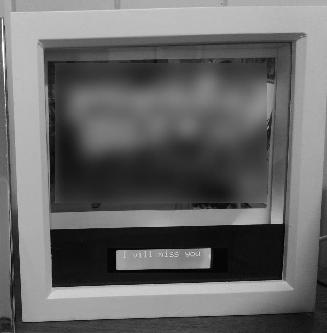
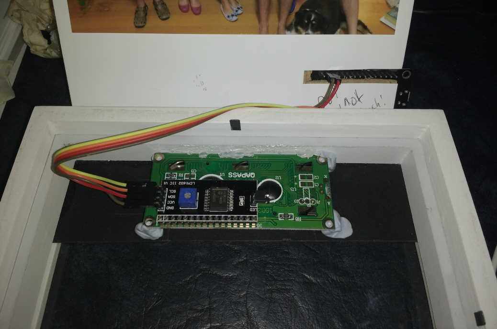
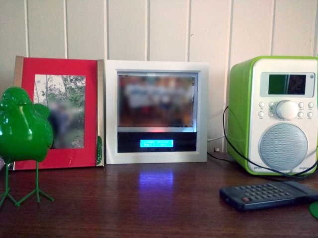

# Photo Frame + realtime date & time, weather and a (remotely changeable) message.

Say you live a great distance (and across timezones) from family or friends, and wish to send them a often updated message in a Photo Frame with a hard print of a photo of relevance. Now you can with this simple project.

In a nutshell, this Arduino project loads a message stored as a text file from a remote server of your choosing + time and weather for two locations from OpenWeatherMaps, and displays on a commonly available 16x2 ASCII character LCD.

# Parts List

1. 15cmx15cm (or larger) [deep photo frame box](https://www.hobbycraft.co.uk/white-deep-box-frame-15cm-x-15cm/567509-1001) (at least 2cm of depth).  
2. [WeMos D1 Mini](https://www.aliexpress.com/item/32529101036.html) (or equivalent ESP 8266 device)
3. [16x2 LCD with I2C](https://www.aliexpress.com/item/32685612494.html)
4. Some [black card paper](https://www.hobbycraft.co.uk/black-card-a4-8-sheets/563048-1000) that you can cut + sharp knife or scissors.
5. Hookup wire.
6. An Open Weather Maps API key in order to perform weather queries - Google "Open Weather Maps" on how to sign-up to get a free API key (needed in the Arduino project code).

Additional requirement: An Internet accessable PHP web server or host.

# Putting it together

1. Cut the paper to about 3cm height and the width of the photo frame. Then cut a rectangle exactly aligned to the the middle for the LCD display to be visable.
2. Place this in the bottom of the Photo Frame.
3. Adjust the CONFIGURATION" section in the Arduino project as required.
4. Upload the public_html scripts and device message file to a webserver somewere that is accessable by the ESP.
5. Upload the code using Arduino to the Arduino ESP8266.
6. Connect the Arduino to the I2C enabled LCD display. Four wires will be used, GND, +5V, SCL (to pin D1 on WeMos Mini) and SDA (to pin D2). Check which standard pins are used for these on your arduino device.
7. Boot-up the Arduino, configure it to the local WiFi network as required.

# Pictures

